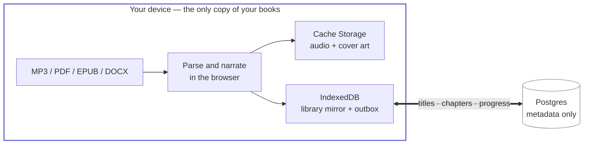

<div align="center">


# Hark

**A private, offline-first audiobook player that runs entirely on your devices.**

Import a chaptered MP3, or hand Hark a PDF, EPUB, DOCX, text, Markdown, or HTML
file and it narrates the document on-device. Your books never touch a server.

[](https://github.com/mchen04/hark-audiobook/actions/workflows/ci.yml)
[](LICENSE)
[](https://nodejs.org)
[](docs/local-first.md)

[Quick start](#quick-start) · [How it works](#how-it-works) · [Documentation](#documentation)

</div>

---

## Why Hark

Every cloud audiobook app asks you to upload your library, and every cloud
text-to-speech service asks you to upload your book. Hark asks for neither.

Audio is parsed, narrated, and stored in your browser. The server sees metadata
only — titles, chapters, progress, playback history — which is what lets your
resume position follow you across devices without your books following it.



Only the mirror has a line to the server, and it carries metadata. No route
exists that can accept or serve audio bytes.

There is no upload path and no object storage. Streamed MP3 imports have no
practical size limit beyond free space, so a 600-hour audiobook imports the same
way a two-hour one does.

## Features

|                     |                                                                                                                                                                                                                                                              |
| ------------------- | ------------------------------------------------------------------------------------------------------------------------------------------------------------------------------------------------------------------------------------------------------------ |
| **Import**          | Parses MP3s entirely in the browser — title, author, narrator, cover art, and ID3/FFMETADATA chapters. Documents route to format-specific local adapters, get narrated by Kestrel Fast through WebGPU (WASM fallback), and are progressively encoded to MP3. |
| **Play**            | Chapters, scrubbing, configurable skip intervals, 0.5x–3x speed, sleep timer, a 50-action history, and lock-screen Media Session controls.                                                                                                                   |
| **Read along**      | MP3s carrying an Epub Listener transcript get a karaoke-style text view: the narrated sentence highlights and auto-scrolls, the spoken word is marked, and tapping a sentence jumps there. Works offline.                                                    |
| **Resume anywhere** | Positions, history, and organization sync with per-device monotonic sequences and deterministic conflict rules. Every write is journaled before it is applied, and replayed by `mutationId` so a retry is a no-op.                                           |
| **Offline**         | The library reads from IndexedDB and `/library` is served from Cache Storage without touching the network. There is no "am I online?" branch on the read path.                                                                                               |
| **Organize**        | Search, status and tag filters, an "On this device" facet, sort orders, grid/list views, collections with optional autoplay, archive, and delete.                                                                                                            |
| **Own your data**   | JSON export of all metadata and progress, plus full account deletion of both server rows and local data.                                                                                                                                                     |

## Quick start

```sh
cp .env.example .env.local   # DATABASE_URL, BETTER_AUTH_SECRET, BETTER_AUTH_URL
pnpm install
pnpm db:migrate
pnpm dev                     # http://localhost:3000
```

Requires Node.js >= 20.19 and pnpm 9.6. Use `pnpm build && pnpm start` when you
need the service worker — it ships only in the production build, so offline
behavior cannot be exercised in dev.

Full setup, the local test database, and every command are in
[docs/development.md](docs/development.md).

## How it works

**Reads are local.** Every book row, chapter, tag, and position is mirrored into
IndexedDB, and the library screen reads only from there. The network syncs
afterwards, in the background.

**Writes are journaled first.** Each mutation is committed to a local outbox
before it is projected onto the mirror, so a crash can leave a queued write with
no visible change, but never a visible change with no queued write.

**Launch does not wait for the network.** Warm-launch p95 measures 291–370ms
across fast, slow, 3000ms-cold-database, and offline profiles — a 70–73ms spread
— with zero server document hits and zero Postgres queries. Measured on a
1,000-book library under a calibrated 16ms CPU budget; see
[`tests/perf/BASELINE.md`](tests/perf/BASELINE.md) for the proven-red baseline
this replaced.

**Document narration is bounded and pinned.** Sources are capped before parsing
(96 MiB PDF, 48 MiB EPUB/DOCX, 8 MiB text/Markdown, 2 MiB HTML, and two million
extracted characters). The first narration downloads about 39 MB of public
Kestrel weights plus a 24 MB pinned browser runtime, integrity-checks them once,
and reuses them thereafter.

## Testing

```sh
pnpm verify:quick     # format, lint, typecheck, Vitest, production build
pnpm verify:browser   # iPhone WebKit, offline parity, sync, resume, launch perf
pnpm verify           # both
```

737 unit tests run in about 3 seconds. Five Playwright projects cover the
browser matrix. What a green run does and does not prove is written down in
[docs/development.md](docs/development.md#what-a-green-run-does-not-prove).

## Known limitations

- **Evicted audio is unrecoverable** without the original file. The MP3 exists
  only on the device that imported it; Hark keeps the book visible, never lets
  it look playable, and reattaches by fingerprint on re-import with progress,
  chapters, tags, and collections intact.
- **The queue drains only while the app is open.** iOS supports no Background
  Sync and will not wake a closed PWA.
- **The library can be one sync behind another device.** That is the explicit
  trade for a launch that does not depend on the network.

## Documentation

Full index in [docs/](docs/README.md).

| Document                                                                    | What it covers                                                                                       |
| --------------------------------------------------------------------------- | ---------------------------------------------------------------------------------------------------- |
| [architecture.md](docs/architecture.md)                                     | Stack, boundaries, data rules, the read model, the write path, the launch path                       |
| [local-first.md](docs/local-first.md)                                       | The design contract: what is mirrored, the outbox, pull, conflict rules, eviction, account lifecycle |
| [development.md](docs/development.md)                                       | Setup, test database, every command, CI, and the limits of a green run                               |
| [operations.md](docs/operations.md)                                         | Deployment, backups, data lifecycle, troubleshooting                                                 |
| [ios-pwa-testing.md](docs/ios-pwa-testing.md)                               | Automated WebKit and physical-iPhone release gates                                                   |
| [resume-durability-device-check.md](docs/resume-durability-device-check.md) | The physical-device resume check and its pass/fail signal                                            |
| [repository-anatomy.md](docs/repository-anatomy.md)                         | Tracked-line breakdown, generated-file policy, large-file classification                             |

## Repository layout

```
src/app/         routes and API
src/components/  UI
src/lib/         device mirror, outbox, storage, playback, Kestrel
src/server/      schema, queries, sync
src/domain/      pure logic
tests/           browser, parity, sync, resume, and performance suites
drizzle/         ordered SQL migrations and snapshots
public/sw.js     the shipping service worker, maintained directly
```

A tracked-text count is about 140k lines, but that is not 140k lines of
application logic: 58.7k are Drizzle's required migration snapshots and 8.5k are
the lockfile. `src/` is 46.3k including 17.1k of co-located unit tests, which
leaves roughly 29.2k lines of application code. See
[repository-anatomy.md](docs/repository-anatomy.md) for the full audit.

## License

Apache License 2.0 — see [LICENSE](LICENSE).

Pinned Kestrel Fast model weights and voice data are fetched from their public
upstream sources at first narration and are not redistributed here; they carry
their own upstream licenses. `src/lib/kestrel/asset-manifest.json` records the
exact model and exporter revisions.
